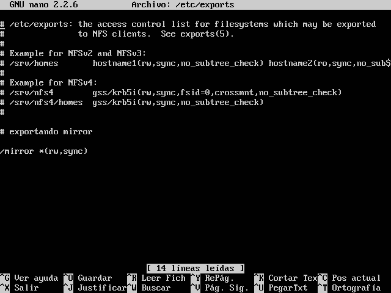
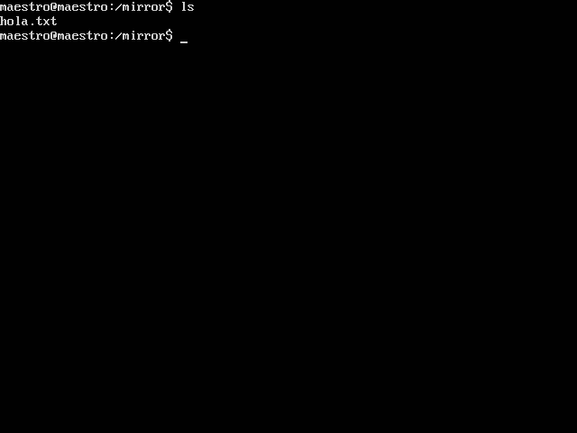
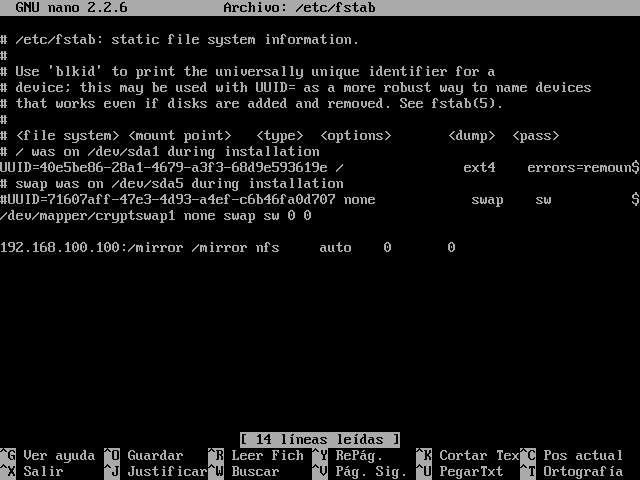
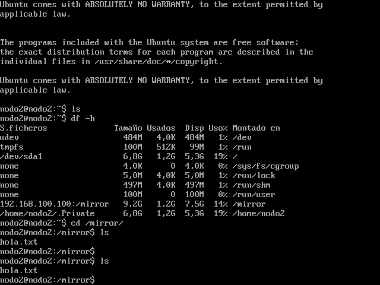
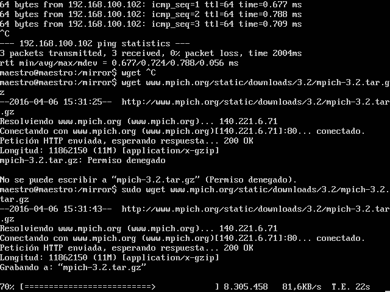
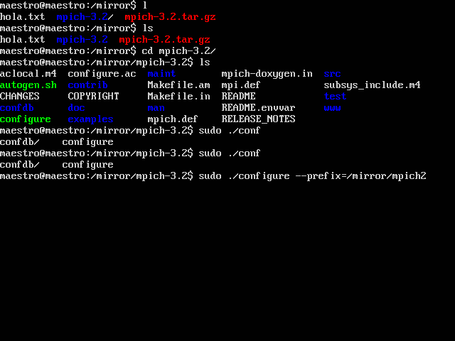
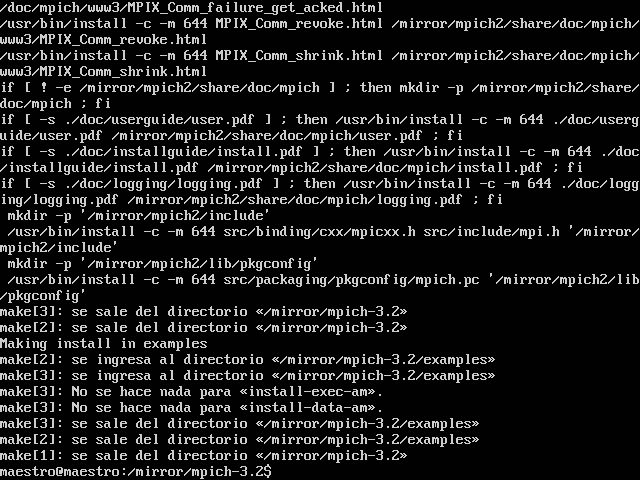

# SSH
https://www.youtube.com/watch?v=0jQrhBplCBY&index=4&list=PLbx-k3N9Yr99WQVwlIdbWdsVxi5ItGL14

# En el servidor

### Instalando los paquetes necesarios
```bash
sudo apt-get install nfs-kernel-server portmap
sudo mkdir /mirror
sudo chown nobody:nogroup /mirror
ls -lta /mirror
```

### exportar NFS
https://www.youtube.com/watch?v=2sr3hN-qCVU&index=5&list=PLbx-k3N9Yr99WQVwlIdbWdsVxi5ItGL14

```bash
sudo nano /etc/exports
```
agregar las lineas al final del archico **`/etc/exports`**
> /mirror *(rw,sync)



```bash
sudo exportfs -a
sudo /etc/init.d/nfs-kernel-server start
cd /mirror
echo "william javier trigos guevara" >> hola.txt
ls -lta /mirror
```


_ _ _

# En el cliente

### en una terminal
```bash
sudo mkdir -p /mirror
```

### Accediendo a NFS tras el booteo
```bash
sudo nano /etc/fstab
```
agregar al final del archivo **`/etc/fstab`**

>192.168.100.100:/mirror /mirror nfs auto  0 0


```bash
sudo reboot
```

### verificar que podemos ver archivos del master
```bash
df -h
cd /mirror
ls -lta
```



# Para MPICH
https://www.youtube.com/watch?v=nmymBKrXlnE&nohtml5=False

==
Tanto en el maestro como en **todas las maquinas**, es necesario tener instalados gcc, g++ y otras dependencias, para ello usamos
==

```bash
sudo apt-get update
sudo apt-get install build-essential gfortran
```

instalar todo en el mismo /mirror que es el folder compartido por NFS

### en el maestro en la carpeta mirror

```bash
cd /mirror
wget http://www.mpich.org/static/downloads/3.2/mpich-3.2.tar.gz
tar xvf mpich-3.2.tar.gz
```


```bash
cd mpich-3.2
sudo ./configure --prefix=/mirror/mpich2 --disable-fortran
```

```bash
sudo make
sudo make install
```


### Finalmente los exports
```bash
export PATH=/mirror/mpich2/bin:$PATH
export LD_LIBRARY_PATH="/mirror/mpich2/lib:$LD_LIBRARY_PATH"
```bash

en **`/etc/enviroment`** añadir
>PATH="/mirror/mpich2/bin:/usr-----"

y todo quedara intalado

## Probando la instalación

sudo apt-get install htop

http://mpitutorial.com/tutorials/mpi-hello-world/

